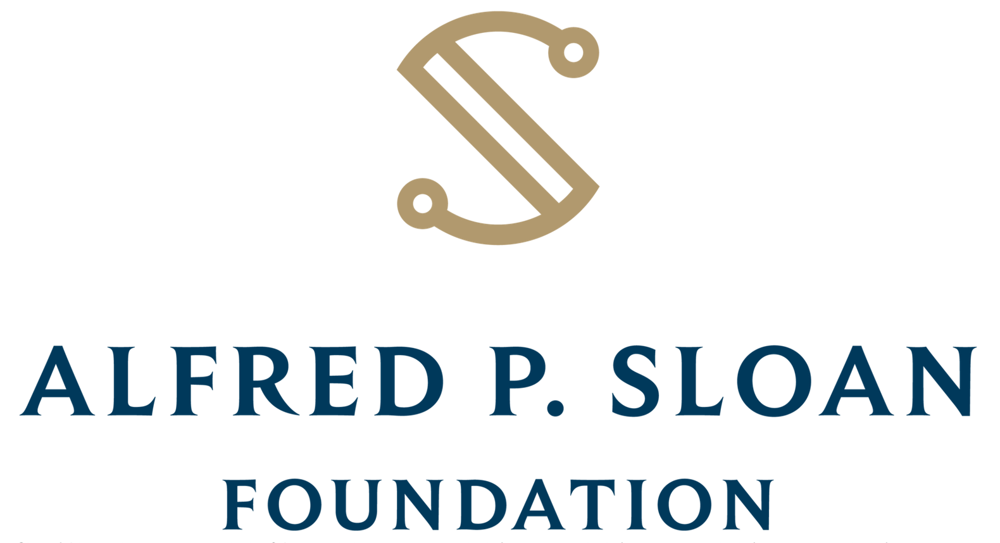

===============================================================================
The Public Utility Data Liberation Project (PUDL)
===============================================================================

.. readme-intro

.. |repo-status| image:: https://www.repostatus.org/badges/latest/active.svg
   :target: https://www.repostatus.org/#active
   :alt: Project Status: Active
.. |pytest| image:: https://github.com/catalyst-cooperative/pudl/workflows/pytest/badge.svg
   :target: https://github.com/catalyst-cooperative/pudl/actions?query=workflow%3Apytest
   :alt: PyTest Status
.. |codecov| image:: https://img.shields.io/codecov/c/github/catalyst-cooperative/pudl?style=flat&logo=codecov
   :target: https://codecov.io/gh/catalyst-cooperative/pudl
   :alt: Codecov Test Coverage
.. |rtd| image:: https://img.shields.io/readthedocs/catalystcoop-pudl?style=flat&logo=readthedocs
   :target: https://catalystcoop-pudl.readthedocs.io/en/nightly/
   :alt: Read the Docs Build Status
.. |ruff| image:: https://img.shields.io/endpoint?url=https://raw.githubusercontent.com/astral-sh/ruff/main/assets/badge/v2.json
   :target: https://github.com/astral-sh/ruff
.. |pre-commit-ci| image:: https://results.pre-commit.ci/badge/github/catalyst-cooperative/pudl/main.svg
   :target: https://results.pre-commit.ci/latest/github/catalyst-cooperative/pudl/main
   :alt: pre-commit CI
.. |zenodo-doi| image:: https://zenodo.org/badge/80646423.svg
   :target: https://zenodo.org/badge/latestdoi/80646423
   :alt: Zenodo DOI
.. |office-hours| image:: https://img.shields.io/badge/calend.ly-officehours-darkgreen
   :target: https://calend.ly/catalyst-cooperative/pudl-office-hours
   :alt: Schedule a 1-on-1 chat with us about PUDL.
.. |mastodon| image:: https://img.shields.io/mastodon/follow/110855618428885893?domain=https%3A%2F%2Fmastodon.energy&style=social&color=%23000000&link=https%3A%2F%2Fmastodon.energy%2F%40catalystcoop
   :target: https://mastodon.energy/@catalystcoop
   :alt: Follow Catalyst Cooperative on Mastodon
.. |slack| image:: https://img.shields.io/badge/Slack-4A154B?logo=slack&logoColor=fff
   :target: https://join.slack.com/t/catalystcooperative/shared_invite/zt-2yg1v2sb7-GsoGlA9Ojc_LCJ00vPWKbQ
.. |linkedin| image:: https://img.shields.io/badge/LinkedIn-0077B5?style=flat&logo=linkedin&logoColor=white
   :target: https://linkedin.com/company/catalyst-cooperative/
   :alt: Follow Catalyst Cooperative on LinkedIn
.. |bluesky| image:: https://img.shields.io/badge/Bluesky-0285FF?logo=bluesky&logoColor=fff&style=flat
   :target: https://bsky.app/profile/catalyst.coop
   :alt: Follow @catalyst.coop on BlueSky
.. |kaggle| image:: https://img.shields.io/badge/Kaggle-20BEFF?style=flat&logo=Kaggle&logoColor=white
   :target: https://www.kaggle.com/datasets/catalystcooperative/pudl-project
   :alt: The PUDL Dataset on Kaggle
.. |youtube| image:: https://img.shields.io/badge/YouTube-%23FF0000.svg?logo=YouTube&logoColor=white
   :target: https://youtube.com/@CatalystCooperative
   :alt: Catalyst Cooperative on YouTube
.. |twitter| image:: https://img.shields.io/badge/X-%23000000.svg?logo=X&logoColor=white
   :target: https://x.com/CatalystCoop
   :alt: Catalyst Cooperative on Twitter
.. |aws| image:: https://img.shields.io/badge/Amazon_AWS-FF9900?style=flat&logo=amazonaws&logoColor=white
   :target: https://registry.opendata.aws/catalyst-cooperative-pudl/
   :alt: PUDL in the AWS Open Data Registry

|repo-status| |pytest| |codecov| |rtd| |ruff| |pre-commit-ci| |zenodo-doi|
|office-hours| |mastodon| |linkedin| |bluesky| |kaggle| |slack| |youtube| |twitter|
|aws|

What is PUDL?
-------------

The `PUDL <https://catalyst.coop/pudl/>`__ Project (pronounced puddle) is an open source
data processing pipeline that makes US energy data easier to access and use
programmatically.

Hundreds of gigabytes of valuable data are published by US government agencies, but it's
often difficult to work with. PUDL takes the original spreadsheets, CSV files, and
databases and turns them into a unified resource. This allows users to spend more time
on novel analysis and less time on data preparation.

The project is focused on serving researchers, activists, journalists, policy makers,
and small businesses that might not otherwise be able to afford access to this data from
commercial sources and who may not have the time or expertise to do all the data
processing themselves from scratch.

We want to make this data accessible and easy to work with for as wide an audience as
possible: anyone from a grassroots youth climate organizers working with Google sheets
to university researchers with access to scalable cloud computing resources and everyone
in between!

PUDL is comprised of three core components:

Raw Data Archives
^^^^^^^^^^^^^^^^^
PUDL `archives <https://github.com/catalyst-cooperative/pudl-archiver>`__ all our raw
inputs on `Zenodo
<https://zenodo.org/communities/catalyst-cooperative/?page=1&size=20>`__ to ensure
permanent, versioned access to the data. In the event that an agency changes how it
publishes data or deletes old files, the data processing pipeline will still have access
to the original inputs. Each of the data inputs may have several different versions
archived, and all are assigned a unique DOI (digital object identifier) and made
available through Zenodo's REST API.  You can read more about the Raw Data Archives in
the `docs <https://catalystcoop-pudl.readthedocs.io/en/nightly/#raw-data-archives>`__.

Data Pipeline
^^^^^^^^^^^^^
The data pipeline (this repo) ingests raw data from the archives, cleans and integrates
it, and writes the resulting tables to `SQLite <https://sqlite.org>`__ and `Apache
Parquet <https://parquet.apache.org/>`__ files, with some accompanying metadata stored as
JSON.  Each release of the PUDL software contains a set of DOIs indicating which
versions of the raw inputs it processes. This helps ensure that the outputs are
replicable. You can read more about our ETL (extract, transform, load) process in the
`PUDL documentation <https://catalystcoop-pudl.readthedocs.io/en/nightly/#the-etl-process>`__.

Data Warehouse
^^^^^^^^^^^^^^
The SQLite, Parquet, and JSON outputs from the data pipeline, sometimes called "PUDL
outputs", are updated each night by an automated build process, and periodically
archived so that users can access the data without having to install and run our data
processing system. These outputs contain hundreds of tables and comprise a small
file-based data warehouse that can be used for a variety of energy system analyses.
Learn more about `how to access the PUDL data
<https://catalystcoop-pudl.readthedocs.io/en/nightly/data_access.html>`__.

What data is available?
-----------------------

PUDL currently integrates data from:

* **EIA Form 860**:
  - `Source Docs <https://www.eia.gov/electricity/data/eia860/>`__
  - `PUDL Docs <https://catalystcoop-pudl.readthedocs.io/en/nightly/data_sources/eia860.html>`__
* **EIA Form 860m**:
  - `Source Docs <https://www.eia.gov/electricity/data/eia860m/>`__
* **EIA Form 861**:
  - `Source Docs <https://www.eia.gov/electricity/data/eia861/>`__
  - `PUDL Docs <https://catalystcoop-pudl.readthedocs.io/en/nightly/data_sources/eia861.html>`__
* **EIA Form 923**:
  - `Source Docs <https://www.eia.gov/electricity/data/eia923/>`__
  - `PUDL Docs <https://catalystcoop-pudl.readthedocs.io/en/nightly/data_sources/eia923.html>`__
* **EIA Form 930**:
  - `Source Docs <https://www.eia.gov/electricity/gridmonitor/>`__
  - `PUDL Docs <https://catalystcoop-pudl.readthedocs.io/en/nightly/data_sources/eia930.html>`__
* **EIA Annual Energy Outlook (AEO)** (a few tables):
  - `Source Docs <https://www.eia.gov/outlooks/aeo/>`__
* **EPA Continuous Emissions Monitoring System (CEMS)**:
  - `Source Docs <https://campd.epa.gov/>`__
  - `PUDL Docs <https://catalystcoop-pudl.readthedocs.io/en/nightly/data_sources/epacems.html>`__
* **FERC Form 1** (dozens of fully processed tables, plus raw data converted to SQLite):
  - `Source Docs <https://www.ferc.gov/industries-data/electric/general-information/electric-industry-forms/form-1-electric-utility-annual>`__
  - `PUDL Docs <https://catalystcoop-pudl.readthedocs.io/en/nightly/data_sources/ferc1.html>`__
* **FERC Form 714** (a few fully processed tables):
  - `Source Docs <https://www.ferc.gov/industries-data/electric/general-information/electric-industry-forms/form-no-714-annual-electric/data>`__
  - `PUDL Docs <https://catalystcoop-pudl.readthedocs.io/en/nightly/data_sources/ferc714.html>`__
* **FERC Form 2** (raw data converted to SQLite):
  - `Source Docs <https://www.ferc.gov/industries-data/natural-gas/industry-forms/form-2-2a-3-q-gas-historical-vfp-data>`__
* **FERC Form 6** (raw data converted to SQLite):
  - `Source Docs <https://www.ferc.gov/general-information-1/oil-industry-forms/form-6-6q-historical-vfp-data>`__
* **FERC Form 60** (raw data converted to SQLite):
  - `Source Docs <https://www.ferc.gov/form-60-annual-report-centralized-service-companies>`__
* **NREL Annual Technology Baseline (ATB) for Electricity**:
  - `Source Docs <https://atb.nrel.gov/electricity/2024/data>`__
* **GridPath Resource Adequacy Toolkit** (partial):
  - `Source Docs <https://gridlab.org/gridpathratoolkit/>`__
  - `PUDL Docs <https://catalystcoop-pudl.readthedocs.io/en/nightly/data_sources/gridpathratoolkit.html>`__
* **US Census Demographic Profile 1 Geodatabase**:
  - `Source Docs <https://www.census.gov/geographies/mapping-files/2010/geo/tiger-data.html>`__

High Priority Target Datasets
-----------------------------

If you're interested in any of these datasets, we'd love to integrate them into PUDL.
Get in touch!

* Additional fully processed FERC Form 1 tables, e.g. Transmission & Distribution assets
* Additional high value EIA AEO tables
* `PHMSA Natural Gas Annual Report <https://www.phmsa.dot.gov/data-and-statistics/pipeline/gas-distribution-gas-gathering-gas-transmission-hazardous-liquids>`__
* `EIA Form 176 <https://www.eia.gov/dnav/ng/TblDefs/NG_DataSources.html#s176>`__
  (The Annual Report of Natural Gas Supply and Disposition)
* `FERC Electric Quarterly Reports (EQR) <https://www.ferc.gov/industries-data/electric/power-sales-and-markets/electric-quarterly-reports-eqr>`__
* `EIA Thermoelectric Water Usage <https://www.eia.gov/electricity/data/water/>`__
* `FERC Form 2 <https://www.ferc.gov/industries-data/natural-gas/overview/general-information/natural-gas-industry-forms/form-22a-data>`__
  (Annual Report of Major Natural Gas Companies)
* `MHSA Mines <https://arlweb.msha.gov/OpenGovernmentData/OGIMSHA.asp>`__

How do I access the data?
-------------------------

For details on how to access PUDL data, see the `data access documentation
<https://catalystcoop-pudl.readthedocs.io/en/nightly/data_access.html>`__. A quick
summary:

* `PUDL Viewer <https://viewer.catalyst.coop>`__ provides search, live preview,
  and CSV export for our processed data. Currently it doesn't provide access to
  the *raw* FERC data - you'll still have to go to Datasette for that.
* `Datasette <https://catalystcoop-pudl.readthedocs.io/en/nightly/data_access.html#-access-datasette>`__
  provides browsable and queryable data from our nightly builds on the web:
  https://data.catalyst.coop
* `Kaggle <https://catalystcoop-pudl.readthedocs.io/en/nightly/data_access.html#access-kaggle>`__
  provides easy Jupyter notebook access to the PUDL data, updated weekly:
  https://www.kaggle.com/datasets/catalystcooperative/pudl-project
* `Cloud storage <https://catalystcoop-pudl.readthedocs.io/en/nightly/data_access.html#access-cloud>`__
  is populated by our nightly data builds, and is free to access thanks to the `AWS
  Open Data Registry <https://registry.opendata.aws/catalyst-cooperative-pudl/>`__.
* `Zenodo <https://catalystcoop-pudl.readthedocs.io/en/nightly/data_access.html#access-zenodo>`__
  provides stable long-term access to our versioned data releases with a citeable DOI:
  https://doi.org/10.5281/zenodo.3653158
* `The PUDL Development Environment <https://catalystcoop-pudl.readthedocs.io/en/nightly/dev/dev_setup.html>`__
  lets you run the PUDL data processing pipeline locally.

Organizations using PUDL
------------------------

.. _pudl_orgs_start:

This is a partial list of organizations that have used PUDL in their work.
If your organization uses PUDL we'd love to list you here! Please open a
pull request or email us at `hello@catalyst.coop <mailto:hello@catalyst.coop>`__!

* `RMI <https://rmi.org>`__ via both their `Utility Transition Hub <https://utilitytransitionhub.rmi.org/>`__ and `Optimus financial modeling tool <https://utilitytransitionhub.rmi.org/optimus/>`__
* `The ZERO Lab at Princeton University <https://zero.lab.princeton.edu>`__
* `PyPSA-USA <https://github.com/PyPSA/pypsa-usa>`__ an open source power systems model.
* `Energy Innovation <https://energyinnovation.org>`__
* `The PowerGenome Project <https://github.com/PowerGenome/PowerGenome>`__
* `Singularity Energy <https://singularity.energy>`__
* `The Open Grid Emissions Initiative <https://singularity.energy/open-grid-emissions>`__
* `Win Climate <https://climate.win>`__
* `The Deployment Gap Model Education Fund <https://www.deploymentgap.fund/>`__

.. _pudl_orgs_end:

Contributing to PUDL
--------------------

Find PUDL useful? Want to help make it better? There are lots of ways to help!

* Check out our `contribution guide <https://catalystcoop-pudl.readthedocs.io/en/nightly/CONTRIBUTING.html>`__
  including our `Code of Conduct <https://catalystcoop-pudl.readthedocs.io/en/nightly/code_of_conduct.html>`__.
* You can file a bug report, make a feature request, or ask questions in the
  `Github issue tracker <https://github.com/catalyst-cooperative/pudl/issues>`__.
* Feel free to fork the project and make a pull request with new code, better
  documentation, or example notebooks.
* `Hire us to do some custom analysis <https://catalyst.coop/hire-catalyst/>`__ and
  allow us to integrate the resulting code into PUDL.

PUDL Sustainers
---------------

The PUDL Sustainers provide ongoing financial support to ensure the open data keeps
flowing, and the project is sustainable long term. They're also involved in our
quarterly planning process. To learn more see `the PUDL Project page on Open Collective
<https://opencollective.com/pudl>`__.

Gigawatt Tier (≥$25,000/year)
^^^^^^^^^^^^^^^^^^^^^^^^^^^^^

.. image:: docs/images/logos/RMI.png
   :width: 600
   :target: https://rmi.org
   :alt: RMI
   :align: center

.. image:: docs/images/logos/GridLab.png
   :width: 600
   :target: https://gridlab.org
   :alt: GridLab
   :align: center

Megawatt Tier (≥$16,000/year)
^^^^^^^^^^^^^^^^^^^^^^^^^^^^^

Become our first `Megawatt tier sustainer <https://opencollective.com/pudl>`__!

Kilowatt Tier (≥$8,000/year)
^^^^^^^^^^^^^^^^^^^^^^^^^^^^

Become our first `kilowatt tier sustainer <https://opencollective.com/pudl>`__!

Major Grant Funders
-------------------

Alfred P. Sloan Foundation
^^^^^^^^^^^^^^^^^^^^^^^^^^

The PUDL Project has been supported by three grants from the `Alfred P. Sloan
Foundation's Energy and Environment Program
<https://sloan.org/programs/research/energy-and-environment>`__, in 2019, 2021, and
2024.

National Science Foundation
^^^^^^^^^^^^^^^^^^^^^^^^^^^

The PUDL Project was awarded a grant from the National Science Foundation's `Pathways to
Enable Open Source Ecosystems (POSE) program
<https://new.nsf.gov/funding/opportunities/pathways-enable-open-source-ecosystems-pose>`__
(`award 2346139 <https://www.nsf.gov/awardsearch/showAward?AWD_ID=2346139>`__) in 2024.

Licensing
---------

In general, our code, data, and other work are permissively licensed for use by anybody,
for any purpose, so long as you give us credit for the work we've done.

* The PUDL software is released under
  `the MIT License <https://opensource.org/licenses/MIT>`__.
* The PUDL data and documentation are published under the
  `Creative Commons Attribution License v4.0 <https://creativecommons.org/licenses/by/4.0/>`__
  (CC-BY-4.0).

Contact Us
----------

* For bug reports, feature requests, and other software or data issues please make a
  `GitHub Issue <https://github.com/catalyst-cooperative/pudl/issues>`__.
* For more general support, questions, or other conversations around the project
  that might be of interest to others, check out the
  `GitHub Discussions <https://github.com/catalyst-cooperative/pudl/discussions>`__
* If you'd like to get occasional updates about the project
  `sign up for our email list <https://catalyst.coop/updates/>`__.
* Want to schedule a time to chat with us one-on-one about your PUDL use case, ideas
  for improvement, or get some personalized support? Join us for
  `Office Hours <https://calend.ly/catalyst-cooperative/pudl-office-hours>`__
* `Follow us here on GitHub <https://github.com/catalyst-cooperative/>`__
* Follow us on Mastodon: `@CatalystCoop@mastodon.energy <https://mastodon.energy/@CatalystCoop>`__
* Follow us on BlueSky:  `@catalyst.coop <https://bsky.app/profile/catalyst.coop>`__
* `Follow us on LinkedIn <https://www.linkedin.com/company/catalyst-cooperative/>`__
* `Follow us on HuggingFace <https://huggingface.co/catalystcooperative>`__
* Follow us on Twitter: `@CatalystCoop <https://twitter.com/CatalystCoop>`__
* `Follow us on Kaggle <https://www.kaggle.com/catalystcooperative/>`__
* `Follow us on YouTube <https://youtube.com/@CatalystCooperative>`__
* `Join our Slack <https://join.slack.com/t/catalystcooperative/shared_invite/zt-2yg1v2sb7-GsoGlA9Ojc_LCJ00vPWKbQ>`__
* More info on our website: https://catalyst.coop
* Email us if you'd like to hire us to provide customized data extraction and analysis:
  `hello@catalyst.coop <mailto:hello@catalyst.coop>`__

About Catalyst Cooperative
--------------------------

`Catalyst Cooperative <https://catalyst.coop>`__ is a small group of data wranglers
and policy wonks organized as a worker-owned cooperative consultancy. Our goal is a
more just, livable, and sustainable world. We integrate public data and perform
custom analyses to inform public policy
(`Hire us! <https://catalyst.coop/hire-catalyst>`__). Our focus is primarily on
mitigating climate change and improving electric utility regulation in the United
States.
