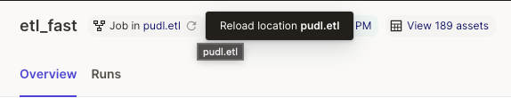
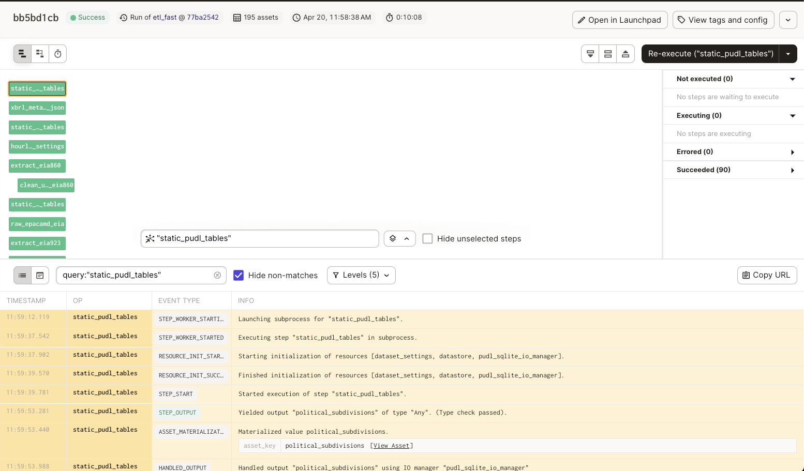
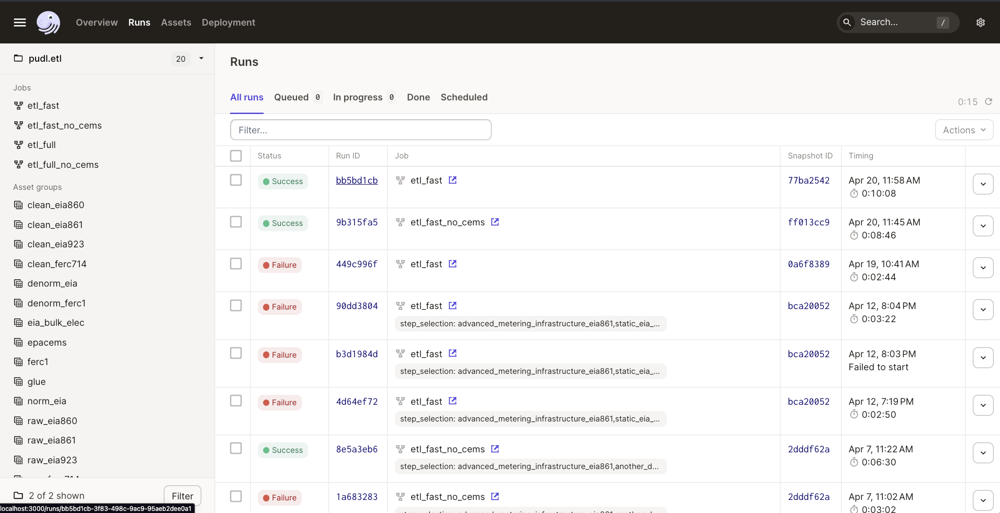
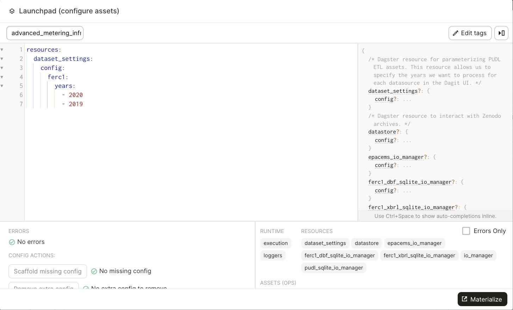

.. _dev_dagster:

===============================================================================
Developing with Dagster
===============================================================================

Reloading code locations
------------------------

When a new asset is added in the code it is not automatically added to the dag in
dagit. To refresh the dag, click the small reload button next to the code location
name in the top part of the UI:

Viewing Logs
------------

To view logs for a specific asset, click on the asset node in the execution
UI for a given Run and Dagster related logs will appear at the bottom of the UI:

To view logs from previous runs, click on the Run tab in the upper left hand
corner, then click the Run ID of the desired run to view the dagster logs.

You can view PUDL logs in the CLI you used to launch dagit. By default, logs
generated using the python logging module are not captured into the Dagster
ecosystem. This means that they are not stored in the Dagster event log, will
not be associated with any Dagster metadata (such as step key, run id, etc.),
and will not show up in the default view of Dagit.

If you need to find the PUDL logs for a previous run, you can seach for the
run ID in the CLI where you launched dagit. The `Dagster docs <https://docs.dagster.io/concepts/logging/python-logging>`__
have more information on how dagster handles logs from Python's logging module.

Assets getting out of sync
--------------------------

Dagster allows contributors to execute individual assets
and debug code changes without having to re-execute upstream
code. This is great, but can introduce some headaches when
developing on multiple branches.

Let's say we have a graph with two assets, A and B where B
depends on A. We execute A and B on ``branch-1``. Then we
update and execute asset A to return an integer instead
of a string. Then we switch to ``branch-2`` where we are
working on some improvements to asset B. If we only execute
asset B on ``branch-2``, it will recieve A's value on
``branch-1``. This is a problem because on ``branch-2``
asset B expects asset A to be a string not an integer.
**To avoid a scenario like this, it is recommended you
re-materialize all assets in the ``pudl.etl`` definition
when you switch branches.**

.. _resource_config:

Configuring resources
---------------------
Dagster resources are python objects that any assets can access.
Resources can be configured using dagit to change the behavior
of a given resource. PUDL currently has three resources:

^^^^^^^^^^^^^^^^^^^^^^^^^^^^^^^^^^^^^^^
:func:`pudl.resources.dataset_settings`
^^^^^^^^^^^^^^^^^^^^^^^^^^^^^^^^^^^^^^^
The ``dataset_settings`` resource tells the PUDL ETL which years
of data to process. You can configure the dataset settings
by holding shift while clicking the "Materialize All" button in the upper
right hand corner of the Dagit interface. This will bring up a window
where you change how the resource is configured:

.. note::

    If a dataset is not specified in the config, the dataset will be
    processed using the default configuration values.

The panel on the right hand side of the window displays the available
config options and the expected types of inputs. You can also hover
over the config options to view the default values. Once you've configured
the resource you can select "Materialize All" to execute the selected
assets.

.. note::

    The configuration edits you make in the dagit UI are only used
    for a single run. If want to save a resource configuration,
    change the default value of the resource or create a new job
    in :mod:`pudl.etl` or :mod:`pudl.ferc_to_sqlite` with the
    preconfigured resource.

^^^^^^^^^^^^^^^^^^^^^^^^^^^^^^^^
:func:`pudl.resources.datastore`
^^^^^^^^^^^^^^^^^^^^^^^^^^^^^^^^

The datastore resource allows assets to to pull data from
PUDL's raw data archives on Zenodo.

^^^^^^^^^^^^^^^^^^^^^^^^^^^^^^^^^^^^^^^^^^^^^^
:func:`pudl.resources.ferc_to_sqlite_settings`
^^^^^^^^^^^^^^^^^^^^^^^^^^^^^^^^^^^^^^^^^^^^^^
The ``ferc_to_sqlite_settings`` resource tells the ``ferc_to_sqlite``
job which years of FERC data to extract.
