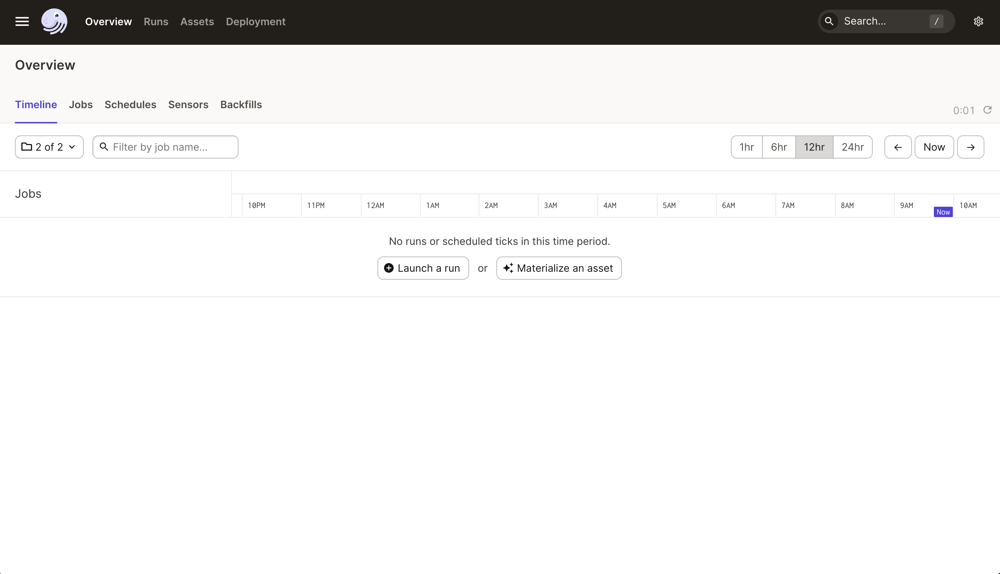
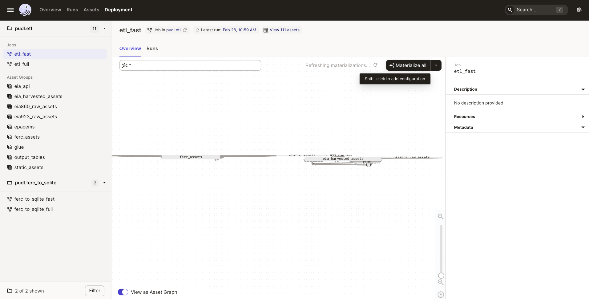

.. _run-the-etl:

===============================================================================
Running the ETL Pipeline
===============================================================================

So you want to run the PUDL data processing pipeline? This is the most involved way
to get access to PUDL data. It's only recommended if you want to edit the ETL process
or contribute to the code base. Check out the :doc:`/data_access` documentation if you
just want to use already processed data.

These instructions assume you have already gone through the :ref:`dev_setup`.

Dagster
-------
PUDL uses `Dagster <https://dagster.io/>`__ to orchestrate its data pipelines. Dagster
makes it easy to manage data dependences, parallelize processes, cache results
and handle IO. If you are planning on contributing to PUDL, it is recommended you
read through the `Dagster Docs <https://docs.dagster.io/getting-started>`__ to
familiarize yourself with the tool's main concepts.

There are a handful of Dagster concepts worth understanding prior
to interacting with the PUDL data processing pipeline:

**Dagit:**
`Dagit <https://docs.dagster.io/concepts/dagit/dagit>`__ is the Dagster
UI for monitoring and executing ETL runs.

**Software Defined Assets (SDAs):**

    *An asset is an object in persistent storage, such as a table, file, or
    persisted machine learning model. A software-defined asset is a Dagster object that
    couples an asset to the function and upstream assets that are used to produce
    its contents.*

`SDAs <https://docs.dagster.io/concepts/assets/software-defined-assets>`__
or "assets", are the computation building blocks in a Dagster project.
Assets are linked together to form a direct acyclic graph (DAG) which can
be executed to persist the data created by the assets. In PUDL, each asset
is a dataframe written to SQLite or parquet files. Assets in PUDL can be
raw extracted dataframes, partially cleaned tables or fully normalized
tables.

SDAs are created by applying the ``@asset`` decorator to a function.

The main PUDL ETL is composed of assets. Assets can be "materialized", which
means running the associated functions and writing the output to disk
somewhere. When you are running the main PUDL ETL, you are **materializing
assets**.

**Operations (Ops):**

`Ops <https://docs.dagster.io/concepts/ops-jobs-graphs/ops>`__ are functions
that are run in a graph. They are not linked to assets, and are a lower-level
building block for orchestrating data processing pipelines.

Due to some limitations of the asset model, we need to use bare ops for the
FERC-to-SQLite workflow. When you are running that phase, you are **launching a
job run**.

**IO Managers:**

    *IO Managers are user-provided objects that store asset outputs
    and load them as inputs to downstream assets.*

Each asset has an `IO Manager
<https://docs.dagster.io/concepts/io-management/io-managers>`__ that tells
Dagster how to handle the objects returned by the software defined asset's
underlying function. The IO Managers in PUDL read and write dataframes to and
from sqlite, pickle and parquet files. For example, the
:func:`pudl.io_managers.pudl_sqlite_io_manager` allows assets to read and write
dataframes and execute SQL statements.

**Resources:**
`Resources <https://docs.dagster.io/concepts/resources>`__ are objects
that can be shared across multiple software-defined assets.
For example, multiple PUDL assets use the :func:`pudl.resources.datastore`
resource to pull data from PUDL's raw data archives on Zenodo.

Generally, inputs to assets should either be other assets or
python objects in Resources.

**Jobs**:
`Jobs <https://docs.dagster.io/concepts/ops-jobs-graphs/jobs>`__
are preconfigured collections of assets, resources and IO Managers.
Jobs are the main unit of execution in Dagster. For example,
the ``etl_fast`` job defined in :mod:`pudl.etl` executes the
FERC, EIA and EPA CEMS pipelines for the most recent year.

**Definitions**:
`Definitions  <https://docs.dagster.io/concepts/code-locations>`__
are collections of assets, resources, IO managers and jobs that can
be loaded into dagit and executed. Definitions can have multiple
preconfigured jobs. For example, the ``pudl.ferc_to_sqlite`` definition
contains ``etl_fast`` and ``etl_full`` jobs.

There are two main Definitions in the PUDL processing pipeline:

1. :func:`pudl.ferc_to_sqlite.defs` :doc:`converts the FERC Form 1, 2, 6, 60 and
   714 DBF/XBRL files <clone_ferc1>` into `SQLite <https://sqlite.org>`__
   databases so that the data are easier to extract, and so all of the raw FERC
   data is available in a modern format. You must run a job in this definition
   before you can execute a job in :func:`pudl.etl.defs`.
2. :func:`pudl.etl.defs` coordinates the "Extract, Transform, Load" process that
   processes 20+ years worth of data from the FERC Form 1 database, dozens of EIA
   spreadsheets, and the thousands of CSV files that make up the EPA CEMS hourly
   emissions data into a clean, well normalized SQLite database (for the FERC and
   EIA data), and an `Apache Parquet <https://parquet.apache.org/>`__ dataset that
   is partitioned by state and year (for the EPA CEMS).

Both definitions have two preconfigured jobs:
  - ``etl_fast`` processes one year of data
  - ``etl_full`` processes all years of data

.. _run-dagit:

Running the ETL with Dagit
--------------------------

Dagster needs a directory to store run logs and some interim assets. We don't
distribute these outputs, so we want to store them separately from
``PUDL_OUTPUT``. Create a new directory outside of the pudl respository
directory called ``dagster_home/``. Then set the ``DAGSTER_HOME`` environment
variable to the path of the new directory:

.. code-block:: console

    $ echo "export DAGSTER_HOME=/path/to/dagster_home/dir" >> ~/.zshrc # zsh
    $ echo "export DAGSTER_HOME=/path/to/dagster_home/dir" >> ~/.bashrc # bash
    $ set -Ux DAGSTER_HOME /path/to/dagster_home/dir # fish

Once ``DAGSTER_HOME`` is set, launch Dagit by running:

.. code-block:: console

    $ dagit -m pudl.etl -m pudl.ferc_to_sqlite

To avoid typing out the dagit command each time you want to launch it,
you can create an alias for the command in your shell:

.. code-block:: console

    $ echo "alias launch_dagit='dagit -m pudl.etl -m pudl.ferc_to_sqlite'" >> ~/.zshrc # zsh
    $ echo "alias launch_dagit='dagit -m pudl.etl -m pudl.ferc_to_sqlite'" >> ~/.bashrc # bash
    $ alias launch_dagit="dagit -m pudl.etl -m pudl.ferc_to_sqlite" # fish

.. note::

    If ``DAGSTER_HOME`` is not set, you will still be able to execute jobs but
    dagster logs and outputs of assets that use the default `fs_io_manager <https://docs.dagster.io/_apidocs/io-managers#dagster.fs_io_manager>`__
    will be saved to a temporary directory that is deleted when dagit exits.

This will launch Dagit at http://localhost:3000/. You should see
a window that looks like this:

Click the hamburger button in the upper left to view the definitions,
assets and jobs.

**Cloning the FERC databases**
To run the data pipelines, you'll first need to create the raw FERC databases by
clicking on one of the ``pudl.ferc_to_sqlite`` jobs. Then select "Launchpad"
where you can adjust the years to extract for each dataset. Then click
"Launch Run" in the lower right hand corner of the window. Dagit will
take you to a new window that provides information about the status of
the job. The bottom part of the window contains dagster logs. You can
view logs from the ``pudl`` package in the CLI window the dagit process
is running in.

If you need to set op configurations, such as the ``clobber`` setting, you can
add them in the Launchpad tab of the job like so::

  ops:
    dbf2sqlite:
      config:
        clobber: true
    xbrl2sqlite:
      config:
        clobber: true

**Running the PUDL ETL**
Once the raw FERC databases are created by a ``pudl.ferc_to_sqlite`` job,
you can execute the main PUDL ETL.

.. note::

  Make sure you've extracted the raw FERC years you are planning to process
  with the main PUDL ETL. Jobs in the ``pudl.etl`` definition will fail if
  the raw FERC databases are missing requested years. For example, if you want
  to process all years available in the ``pudl.etl`` definition make sure
  you've extracted all years of the raw FERC data.

Select one of the ``pudl.etl`` jobs.
This will bring you to a window that displays all of the asset dependencies
in the ``pudl.etl`` definition. Subsets of the ``pudl.etl`` asset graph
are organized by asset groups. These groups are helfpul for visualizing and
executing subsets of the asset graph.

To execute the job, select ``fast_etl`` or ``full_etl`` and click "Materialize all".
You can congifure which years to process by shift+clicking "Materialize all".
To view the status of the run, click the date next to "Latest run:".

You can also re-execute specific assets by selecting one or
multiple assets in the "Overview" tab and clicking "Materialize selected".
This is helpful if you are updating the logic of a specific asset and don't
want to rerun the entire ETL.

.. note::

  Dagster will throw an ``DagsterInvalidSubsetError`` if you try to
  re-execute a subset of assets produced by a single function. This can
  be resolved by re-materializing the asset group of the desired asset.

.. _run-cli:

Running the ETL with CLI Commands
---------------------------------
You can also execute the ETL jobs using CLI commands. These are thin wrappers around
Dagster's job execution API.

.. note::

  We recommend using Dagit to execute the ETL as it provides additional
  functionality for re-execution and viewing asset dependences.

There are two main CLI commands for executing the PUDL processing pipeline:

1. ``ferc_to_sqlite`` executes the ``pudl.ferc_to_sqlite`` dagster graph.
   You must run this script before you can run ``pudl_etl``.
2. ``pudl_etl`` executes the ``pudl.etl`` asset graph.

Settings Files
--------------
These CLI commands use YAML settings files in place of command line arguments.
This avoids undue complexity and preserves a record of how the script was run.
The YAML file dictates which years, or states get run through the the processing
pipeline. Two example files are deployed in the ``settings`` folder that is created when
you run ``pudl_setup``. (see: :ref:`install-workspace`).

- ``etl_fast.yml`` processes one year of data
- ``etl_full.yml`` processes all years of data

.. warning::

  In previous versions of PUDL, you could specify which datasources to process
  using the settings file. With the migration to dagster, all datasources are
  processed no matter what datasources are included in the settings file.
  If you want to process a single datasource, materialize the appropriate assets
  in dagit. (see :ref:`run-dagit`).

Each file contains instructions for how to process the data under "full" or "fast"
conditions respectively. You can copy, rename, and modify these files to suit your
needs. The layout of these files is depicted below:

.. code-block::

      # FERC1 to SQLite settings
      ferc_to_sqlite_settings:
        ├── ferc1_dbf_to_sqlite_settings
        |   └── years
        ├── ferc1_xbrl_to_sqlite_settings
        |   └── years
        ├── ferc2_xbrl_to_sqlite_settings
        |   └── years

      # PUDL ETL settings
      name : unique name identifying the etl outputs
      title : short human readable title for the etl outputs
      description : a longer description of the etl outputs
      datasets:
        ├── dataset name
        │    └── dataset etl parameter (e.g. years) : editable list of years
        └── dataset name
        │    └── dataset etl parameter (e.g. years) : editable list of years

.. note::

    Do not change anything other than the dataset parameters and the name, title, and
    description fields unless you want to remove an entire dataset. For example, CEMS
    data takes a long time to load so you can comment out or delete all settings
    pertaining to CEMS. See below for a way to add it later.

Both scripts enable you to choose which **years** you want to include:

.. list-table::
   :header-rows: 1
   :widths: auto

   * - Parameter
     - Description
   * - ``years``
     - A list of years to be included in the FERC Form 1 Raw DB or the PUDL DB. You
       should only use a continuous range of years. Check the :doc:`/data_sources/index`
       pages for the earliest available years.

The ``pudl_etl`` script CEMS data allows you to select **years** and **states**.

.. list-table::
   :header-rows: 1
   :widths: auto

   * - Parameter
     - Description
   * - ``years``
     - A list of the years you'd like to process CEMS data for. You should
       only use a continuous range of years. Check the :doc:`/data_sources/epacems` page
       for the earliest available years.
   * - ``states``
     - A list of the state codes you'd like to process CEMS data for. You can specify
       ``all`` if you want to process data for all states. This may take a while!

.. seealso::

      For an exhaustive listing of the available parameters, see the ``etl_full.yml``
      file.

There are a few notable dependencies to be wary of when fiddling with these
settings:

- The ``ferc_to_sqlite`` job must be executed prior to running ``pudl_etl``
  job.

- EPA CEMS cannot be loaded without EIA data unless you have existing PUDL database.

Now that your settings are configured, you're ready to run the scripts

The Fast ETL
------------
Running the Fast ETL processes one year of data for each dataset. This is what
we do in our :doc:`software integration tests <testing>`. Depending on your computer,
it should take around 15 minutes total.

.. code-block:: console

    $ ferc_to_sqlite settings/etl_fast.yml
    $ pudl_etl settings/etl_fast.yml

The Full ETL
------------
The Full ETL settings includes all all available data that PUDL can process. All
the years, all the states, and all the tables, including the ~1 billion record
EPA CEMS dataset. Assuming you already have the data downloaded, on a computer
with at least 16 GB of RAM, and a solid-state disk, the Full ETL including EPA
CEMS should take around 2 hours.

.. code-block:: console

    $ ferc_to_sqlite settings/etl_full.yml
    $ pudl_etl settings/etl_full.yml

Custom ETL
----------
You've changed the settings and renamed the file to CUSTOM_ETL.yml

.. code-block:: console

    $ ferc_to_sqlite settings/CUSTOM_ETL.yml
    $ pudl_etl settings/CUSTOM_ETL.yml

.. _add-cems-later:

Processing EPA CEMS Separately
------------------------------
As mentioned above, CEMS takes a while to process. Luckily, we've designed PUDL so that
if you delete or comment out CEMS lines in the settings file, you can process it
independently later without reprocessing the FERC and EIA data. The following script
will refer to your existing PUDL database for the information it needs and act as if the
FERC and EIA ETL had just been run. This may go without saying, but you need an existing
PUDL DB with the appropriate EIA files in order for the script to work.

.. code-block:: console

    $ epacems_to_parquet -y [YEARS] -s [STATES]

This script does not have a YAML settings file, so you must specify which years and
states to include via command line arguments. Run ``epacems_to_parquet --help`` to
verify your options. Changing CEMS settings in a YAML file will not inform this script!
Running the script without any arguments will automatically process all states and
years.

.. warning::

    If you process the EPA CEMS data after the fact (i.e., with the
    ``epacems_to_parquet`` script), be careful that the version of PUDL used to generate
    the DB is the same as the one you're using to process the CEMS data. Otherwise the
    process and data may be incompatible with unpredictable results.

Additional Notes
----------------
The commands above should result in a bunch of Python :mod:`logging` output
describing what the script is doing, and file outputs in the ``output``
directory within your workspace. When the ETL is complete, you
should see new files at ``output/ferc1.sqlite`` and ``output/pudl.sqlite`` as
well as a new directory at ``output/hourly_emissions_epacems`` containing
nested directories named by year and state.

If you need to re-run ``ferc_to_sqlite`` and want to overwrite
their previous outputs you can add ``--clobber`` (run ``ferc_to_sqlite --clobber``).
All of the PUDL scripts also have help messages if you want additional information
(run ``script_name --help``).

.. note::

  The ``pudl_etl`` command does not have a ``--clobber`` option because
  each etl run uses the same database file to read and write tables.
  This enables re-running portions of the ETL.

Foreign Keys
------------
The order assets are loaded into ``pudl.sqlite`` is non deterministic because the
assets are executed in parallel so foreign key constraints can not be evaluated in
real time. However, foreign key constraints can be evaluated after all of the data
has been loaded into the database. To check the constraints, run:

.. code-block:: console

   $ pudl_check_fks
