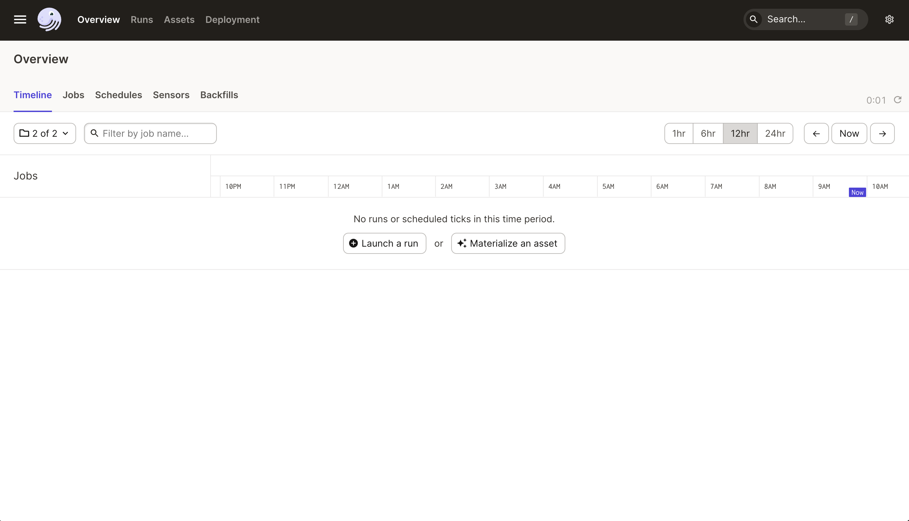
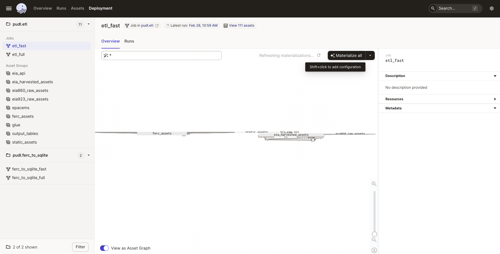

.. _run_the_etl:

===============================================================================
Running the ETL Pipeline
===============================================================================

So you want to run the PUDL data processing pipeline? This is the most involved way
to get access to PUDL data. It's only recommended if you want to edit the ETL process
or contribute to the code base. Check out the :doc:`/data_access` documentation if you
just want to use already processed data.

These instructions assume you have already gone through the :ref:`dev_setup`.

Database initialization
-----------------------

Before we run anything, we'll need to make sure that the schema in the database
actually matches the schema in the code - run ``alembic upgrade head`` to create
the database with the right schema. If you already have a ``pudl.sqlite`` you'll
need to delete it first.

Database schema migration
-------------------------

If you've changed the database schema, you'll need to make a migration for that
change and apply that migration to the database to keep the database schema up-
to-date:

.. code-block:: bash

    $ alembic revision --autogenerate -m "Add my cool table"
    $ alembic upgrade head
    $ git add migrations
    $ git commit -m "Migration: added my cool table"

When switching branches, Alembic may refer to a migration version that is not
on your current branch. This will manifest as an error like this when running an
Alembic command::

    FAILED: Can't locate revision identified by '29d443aadf25'

If you encounter that, you will want to check out the git branch that *does*
include that migration in the ``migrations`` directory. Then you should run
``alembic downgrade head-1`` to revert the database to the prior version. Then
you can go back to the branch that doesn't have your migration, and use Alembic
in peace.

If the migrations have diverged for more than one revision, you can specify the
specific version you would like to downgrade to with its hash. You may also
want to keep a copy of the old SQLite database around, so you can easily switch
between branches without having to regenerate data.

More information can be found in the `Alembic docs
<https://alembic.sqlalchemy.org/en/latest/tutorial.html>`__.

Dagster
-------
PUDL uses `Dagster <https://dagster.io/>`__ to orchestrate its data pipelines. Dagster
makes it easy to manage data dependences, parallelize processes, cache results
and handle IO. If you are planning on contributing to PUDL, it is recommended you
read through the `Dagster Docs <https://docs.dagster.io/getting-started>`__ to
familiarize yourself with the tool's main concepts.

^^^^^^^^^^^^^^^^^
``dg`` quickstart
^^^^^^^^^^^^^^^^^

PUDL is configured as a ``dg`` project. ``dg`` is Dagster's official CLI. It can run
most if not all of the tasks managed through the UI.

.. code-block:: console

    # Start up the Dagster UI webserver and daemons
    $ pixi run dg dev
    # Launch a full job with its default config
    $ pixi run dg launch --job pudl
    # Select a subset of assets to materialize
    $ pixi run dg launch --assets "group:raw_eia861"
    # List all of the Dagster definitions
    $ pixi run dg list defs

For full ``dg`` CLI documentation and options, see the Dagster docs:
`dg CLI reference <https://docs.dagster.io/api/clis/dg-cli/dg-cli-reference>`__.

There are a handful of Dagster concepts worth understanding prior
to interacting with the PUDL data processing pipeline:

Dagster UI
^^^^^^^^^^

`The Dagster UI <https://docs.dagster.io/concepts/webserver/ui>`__
is used for monitoring and executing ETL runs.

Software Defined Assets (SDAs)
^^^^^^^^^^^^^^^^^^^^^^^^^^^^^^

    *An asset is an object in persistent storage, such as a table, file, or
    persisted machine learning model. A software-defined asset is a Dagster object that
    couples an asset to the function and upstream assets that are used to produce
    its contents.*

`SDAs <https://docs.dagster.io/concepts/assets/software-defined-assets>`__
or "assets", are the computation building blocks in a Dagster project.
Assets are linked together to form a direct acyclic graph (DAG) which can
be executed to persist the data created by the assets. In PUDL, each asset
is a dataframe written to SQLite or parquet files. Assets in PUDL can be
raw extracted dataframes, partially cleaned tables or fully normalized
tables.

SDAs are created by applying the ``@asset`` decorator to a function.

The main PUDL ETL is composed of assets. Assets can be "materialized", which
means running the associated functions and writing the output to disk
somewhere. When you are running the main PUDL ETL, you are **materializing
assets**.

IO Managers:
^^^^^^^^^^^^

    *IO Managers are user-provided objects that store asset outputs
    and load them as inputs to downstream assets.*

Each asset has an `IO Manager
<https://docs.dagster.io/concepts/io-management/io-managers>`__ that tells
Dagster how to handle the objects returned by the software defined asset's
underlying function. The IO Managers in PUDL read and write dataframes to and
from sqlite, pickle and parquet files. For example, the
:func:`pudl.io_managers.pudl_sqlite_io_manager` allows assets to read and write
dataframes and execute SQL statements.

Resources:
^^^^^^^^^^

`Resources <https://docs.dagster.io/concepts/resources>`__ are objects
that can be shared across multiple software-defined assets.
For example, multiple PUDL assets use the :func:`pudl.resources.datastore`
resource to pull data from PUDL's raw data archives on Zenodo.

Generally, inputs to assets should either be other assets or
python objects in Resources.

Jobs
^^^^
`Jobs <https://docs.dagster.io/concepts/ops-jobs-graphs/jobs>`__
are preconfigured collections of assets, resources and IO Managers.
Jobs are the main unit of execution in Dagster. The ``pudl`` job
defined in :mod:`pudl.etl` process all of the core PUDL datasets.

Definitions
^^^^^^^^^^^
`Definitions  <https://docs.dagster.io/concepts/code-locations>`__
are collections of assets, resources, IO managers and jobs that can
be loaded into the dagster UI and executed.

The entire PUDL processing pipeline, including :doc:`converting the FERC Form 1,
2, 6, 60 and 714 DBF/XBRL files <clone_ferc1>`, is assembled in
:func:`pudl.etl.defs`. There is a single preconfigured job called ``pudl`` that
runs the full pipeline.

.. _run-dagster-ui:

Running the ETL via the Dagster UI
----------------------------------

Dagster needs a directory to store run logs and some interim assets. We don't
distribute these outputs, so we want to store them separately from
``PUDL_OUTPUT``. Create a new directory outside of the pudl repository
directory called ``dagster_home/``. Then set the ``DAGSTER_HOME`` environment
variable to the path of the new directory:

.. code-block:: console

    $ echo "export DAGSTER_HOME=/path/to/dagster_home" >> ~/.zshrc # zsh
    $ echo "export DAGSTER_HOME=/path/to/dagster_home" >> ~/.bashrc # bash
    $ set -Ux DAGSTER_HOME /path/to/dagster_home # fish

Add ``DAGSTER_HOME`` to the current session with

.. code-block:: console

    $ export DAGSTER_HOME=/path/to/dagster_home

Once ``DAGSTER_HOME`` is set, launch the dagster UI by running:

.. code-block:: console

    $ pixi run dg dev

.. note::

    If ``DAGSTER_HOME`` is not set, you will still be able to execute jobs but dagster
    logs and outputs of assets that use the default `fs_io_manager
    <https://docs.dagster.io/_apidocs/io-managers#dagster.fs_io_manager>`__ will be
    saved to a temporary directory that is deleted when the ``dagster`` process exits.

This will launch the dagster UI at http://localhost:3000/. You should see
a window that looks like this:

Click the hamburger button in the upper left to view the definitions,
assets and jobs.

^^^^^^^^^^^^^^^^^^^^^^^^^^
Cloning the FERC databases
^^^^^^^^^^^^^^^^^^^^^^^^^^

The raw FERC databases (SQLite, DuckDB) are created as part of the ``pudl`` job, in the
``raw_ferc_to_sqlite`` asset group. You do not need to run a separate step before
launching the main PUDL ETL.

.. TODO::

   Figure out ergonomic workflow that doesn't require rematerializing the FERC DBs
   every time we want to freshen up the downsream PUDL assets.

^^^^^^^^^^^^^^^^^^^^
Running the PUDL ETL
^^^^^^^^^^^^^^^^^^^^

Select the ``pudl`` job. This will bring you to a window that displays all of the asset
dependencies. Subsets of the asset graph are organized by asset groups, which are
helpful for visualizing and executing subsets of the asset graph.

To execute the job click "Materialize all".
Read the :ref:`resource_config` section to learn more.
To view the status of the run, click the date next to "Latest run:".

You can also re-execute specific assets by selecting one or
multiple assets in the "Overview" tab and clicking "Materialize selected".
This is helpful if you are updating the logic of a specific asset and don't
want to rerun the entire ETL.

.. note::

  Dagster does not allow you to select asset groups for a specific job.  For example, if
  you click on the ``raw_eia860`` asset group in the Dagster UI click "Materialize All",
  the default configuration values will be used so all available years of the data will
  be extracted.

  To process a subset of years for a specific asset group, select the asset group,
  shift+click "Materialize all" and configure the ``dataset_settings`` resource with the
  desired years.

.. note::

  Dagster will throw an ``DagsterInvalidSubsetError`` if you try to
  re-execute a subset of assets produced by a single function. This can
  be resolved by re-materializing the asset group of the desired asset.

Read the :ref:`dev_dagster` documentation page to learn more about working
with dagster.

^^^^^^^^^^^^^^^^^^^^^^^^^^
Running the FERC EQR ETL
^^^^^^^^^^^^^^^^^^^^^^^^^^
All processing for FERC EQR data is contained in a separate ETL from the
rest of PUDL. This is because the dataset is too large to archive the raw
data on Zenodo. This means the ETL can only be run by developers with credentials
to access private cloud storage containing the raw data. Any external
contributors interested in working on this ETL should contact the Catalyst team
to set up access to the raw data.

The FERC EQR ETL is contained in a Dagster job called ``ferceqr_etl``.
Executing this job from the Dagster UI is slightly different from the main
PUDL ETL jobs because the EQR job uses Dagster partitions. After selecting
"Materialize All" (or "Materialize selected" for a selection of assets),
a screen will popup allowing you to select the partitions to execute.
From here you can select a set of year-quarter combinations. This will
trigger a ``backfill``, which will execute each partition in its own ``run``.
To properly handle a ``backfill``, you will need to configure dagster to use a
``QueuedRunCoordinator``. This can be done using a ``dagster.yaml`` file in your
``DAGSTER_HOME`` directory with the following content:

.. code-block:: yaml

   run_coordinator:
     module: dagster.core.run_coordinator
     class: QueuedRunCoordinator
     config:
       tag_concurrency_limits:
         - key: "dagster/backfill"
           limit: 2

The ``config`` section shown above is not strictly necessary, but will limit the
number of concurrent ``runs`` Dagster will start, which can be helpful to avoid
out-of-memory issues while running many quarters in one ``backfill``.

.. _run-cli:

Running the ETL via CLI
-----------------------

The ``dg`` command line interface is Dagster's official tool and has a ton of built-in
functionality. For full documentation see the Dagster docs:
`dg CLI reference <https://docs.dagster.io/api/clis/dg-cli/dg-cli-reference>`__.

These commands are a quick way to confirm your local Dagster setup is healthy before
launching runs:

.. code-block:: console

    $ pixi run dg check toml
    $ pixi run dg check defs --verbose
    $ pixi run dg list defs

You can also kick off full jobs with their default configuration using ``dg launch``.
The Dagster UI does not need to be running for this to work, but if it is running,
you'll see the run appear in it.

.. code-block:: console

  $ pixi run dg launch --job pudl

You can also target specific assets rather than an entire job, and use Dagster's rich
`asset selection syntax <https://docs.dagster.io/guides/build/assets/asset-selection-syntax/reference>`__
to pick and choose:

.. code-block:: console

  # Materialize all assets in the raw_eia861 group
  $ pixi run dg launch --assets "group:raw_eia861"
  # Materialize all assets upstream and downstream of a table
  $ pixi run dg launch --assets "+key:core_eia923__fuel_receipts_costs+"

.. note::

  We recommend using the Dagster UI to execute the ETL as it provides additional
  functionality for re-execution and viewing asset dependences.

We also have a ``pixi`` task defined in ``pyproject.toml`` to process all data with
the full default configuration (this can take hours):

.. code-block:: console

    $ pixi run pudl

Settings Files
--------------
The ``dg launch`` command can read run configuration from YAML files. This avoids
undue command line complexity and preserves a record of how the pipeline was run.
There are two standard Dagster config files that we use for local development and
nightly builds:

- ``src/pudl/package_data/settings/dg_fast.yml`` configures a smaller, faster run.
- ``src/pudl/package_data/settings/dg_full.yml`` processes all available data.

.. warning::

  In previous versions of PUDL, you could specify which datasources to process
  using the settings file. With the migration to dagster, all datasources are
  processed no matter what datasources are included in the settings file.
  If you want to process a single datasource, materialize the appropriate assets
  in the dagster UI. (see :ref:`run-dagster-ui`).

Each file includes run execution options and resource configuration, including
the ``etl_settings_path`` used by the PUDL dataset and FERC extraction settings. The
PUDL ETL settings YAML files that are referenced by our Dagster configs specify which
datasets and what portions of each of them should be processed, and are generally
structured like this:

.. code-block::

      # FERC1 to SQLite settings
      ferc_to_sqlite_settings:
        ├── ferc1_dbf_to_sqlite_settings
        |   └── years
        ├── ferc1_xbrl_to_sqlite_settings
        |   └── years
        └── ferc2_xbrl_to_sqlite_settings
            └── years

      # PUDL ETL settings
      name : unique name identifying the etl outputs
      title : short human readable title for the etl outputs
      description : a longer description of the etl outputs
      datasets:
        ├── dataset name
        │    └── dataset etl parameter (e.g. years) : editable list of years
        └── dataset name
             └── dataset etl parameter (e.g. years) : editable list of years

.. seealso::

      For an exhaustive listing of the available parameters, see the ``etl_full.yml``
      file.

There are a few notable dependencies to be wary of when fiddling with these
settings:

- EPA CEMS cannot be loaded without EIA data unless you have existing PUDL database.

Now that your settings are configured, you're ready to launch the ETL.

The Fast ETL
------------
Running the Fast ETL processes 1-2 years of data for each dataset. This is what
we do in our :doc:`software integration tests <testing>`. Depending on your computer,
it may take up to an hour to run.

.. code-block:: console

  $ pixi run dg launch --job pudl --config src/pudl/package_data/settings/dg_fast.yml

The Full ETL
------------
The Full ETL settings includes all all available data that PUDL can process. All
the years, all the states, and all the tables, including the ~1 billion record
EPA CEMS dataset. Assuming you already have the data downloaded, on a computer
with at least 16 GB of RAM, and a solid-state disk, the Full ETL including EPA
CEMS should take around 2 hours.

.. code-block:: console

  $ pixi run dg launch --job pudl --config src/pudl/package_data/settings/dg_full.yml

Custom ETL
----------
You've changed the settings and renamed the file to CUSTOM_ETL.yml

.. code-block:: console

  $ pixi run dg launch --job pudl --config the/path/to/your/custom_dg_config.yml

Additional Notes
----------------
The commands above should result in a bunch of Python :mod:`logging` output describing
what the script is doing, and file outputs the directory you specified via the
``$PUDL_OUTPUT`` environment variable. When the ETL is complete, you should see new
files at e.g. ``$PUDL_OUTPUT/ferc1_dbf.sqlite``, ``$PUDL_OUTPUT/pudl.sqlite`` and
``$PUDL_OUTPUT/core_epacems__hourly_emissions.parquet``.

All of the PUDL scripts also have help messages if you want additional information (run
``script_name --help``).

Foreign Keys
------------
The order assets are loaded into ``pudl.sqlite`` is non deterministic because the
assets are executed in parallel so foreign key constraints can not be evaluated in
real time. However, foreign key constraints can be evaluated after all of the data
has been loaded into the database. To check the constraints, run:

.. code-block:: console

   $ pudl_check_fks
