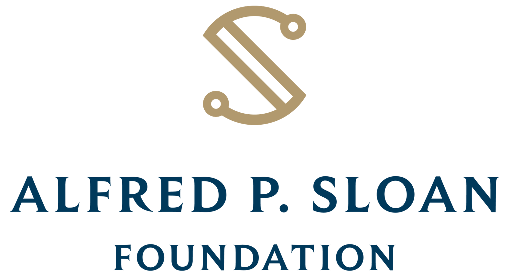

===============================================================================
The Public Utility Data Liberation Project
===============================================================================

PUDL (pronounced puddle) is a data processing pipeline created by `Catalyst Cooperative
<https://catalyst.coop/>`__ that cleans, integrates, and standardizes some of the most
widely used public energy datasets in the US. The data serve researchers, activists,
journalists, and policy makers that might not have the technical expertise to access it
in its raw form, the time to clean and prepare the data for bulk analysis, or the means
to purchase it from  existing commercial providers.

---------------------------------------------------------------------------------------
Available Data
---------------------------------------------------------------------------------------

We focus primarily on poorly curated data published by the US government in
semi-structured but machine readable formats. For details on exactly what data is
available from these data sources and what state it is in, see the individual
pages for each source:

* :doc:`data_sources/eia860`
* :doc:`data_sources/eia861`
* :doc:`data_sources/eia923`
* :doc:`data_sources/eia930`
* :doc:`data_sources/epacems`
* :doc:`data_sources/ferc1`
* :doc:`data_sources/ferc714`
* :doc:`data_sources/phmsagas`

PUDL's clean and complete versions of these data sources are stored in the
``pudl.sqlite`` database. Larger datasets, like EPA CEMS, are stored in parquet files.
To get started using PUDL data, visit our :doc:`data_access` page, or continue reading
to learn more about the PUDL data processing pipeline.

We also publish SQLite databases containing relatively pristine versions of our more
difficult to parse inputs, especially the old Visual FoxPro (DBF, pre-2021) and new XBRL
data (2021+) published by FERC:

* `FERC Form 1 (DBF) <https://s3.us-west-2.amazonaws.com/pudl.catalyst.coop/nightly/ferc1_dbf.sqlite.zip>`__
* `FERC Form 1 (XBRL) <https://s3.us-west-2.amazonaws.com/pudl.catalyst.coop/nightly/ferc1_xbrl.sqlite.zip>`__
* `FERC Form 2 (DBF) <https://s3.us-west-2.amazonaws.com/pudl.catalyst.coop/nightly/ferc2_dbf.sqlite.zip>`__
* `FERC Form 2 (XBRL) <https://s3.us-west-2.amazonaws.com/pudl.catalyst.coop/nightly/ferc2_xbrl.sqlite.zip>`__
* `FERC Form 6 (DBF) <https://s3.us-west-2.amazonaws.com/pudl.catalyst.coop/nightly/ferc6_dbf.sqlite.zip>`__
* `FERC Form 6 (XBRL) <https://s3.us-west-2.amazonaws.com/pudl.catalyst.coop/nightly/ferc6_xbrl.sqlite.zip>`__
* `FERC Form 60 (DBF) <https://s3.us-west-2.amazonaws.com/pudl.catalyst.coop/nightly/ferc60_dbf.sqlite.zip>`__
* `FERC Form 60 (XBRL) <https://s3.us-west-2.amazonaws.com/pudl.catalyst.coop/nightly/ferc60_xbrl.sqlite.zip>`__
* `FERC Form 714 (XBRL) <https://s3.us-west-2.amazonaws.com/pudl.catalyst.coop/nightly/ferc714_xbrl.sqlite.zip>`__

.. _raw-data-archive:

---------------------------------------------------------------------------------------
Raw Data Archives
---------------------------------------------------------------------------------------

PUDL depends on "raw" data inputs from sources that are known to occasionally update
their data or alter the published format. These changes may be incompatible with the way
the data are read and interpreted by PUDL, so, to ensure the integrity of our data
processing, we periodically create archives of `the raw inputs on Zenodo
<https://zenodo.org/communities/catalyst-cooperative>`__. Each of the data inputs may
have several different versions archived, and all are assigned a unique DOI and made
available through the REST API.  Each release of the PUDL Python package is embedded
with a set of DOIs to indicate which version of the raw inputs it is meant to
process. This process helps ensure that our outputs are replicable.

To enable programmatic access to individual partitions of the data (by year, state,
etc.), we archive the raw inputs as `Frictionless Data Packages
<https://specs.frictionlessdata.io/data-package/>`__. The data packages contain both the
raw data in their originally published format (CSVs, Excel spreadsheets, and Visual
FoxPro database (DBF) files) and metadata that describes how each dataset is
partitioned.

The PUDL software will download a copy of the appropriate raw inputs automatically as
needed and organize them in a local :doc:`datastore <dev/datastore>`.

.. seealso::

    The software that creates and archives the raw inputs can be found in our
    `PUDL Archiver <https://github.com/catalyst-cooperative/pudl-archiver>`__
    repository on GitHub.

.. _etl-process:

---------------------------------------------------------------------------------------
The ETL Process
---------------------------------------------------------------------------------------

PUDL's ETL produces a data warehouse that can be used for analytics.
The processing happens within Dagster assets that are persisted to storage,
typically pickle, parquet or SQLite files. The raw data moves through three
layers of processing.

Raw Layer
^^^^^^^^^

Assets in the Raw layer read the raw data from the original heterogeneous formats into
a collection of :class:`pandas.DataFrame` with uniform column names across all years so
that it can be easily processed in bulk. Data distributed as binary database files, such
as the DBF files from FERC Form 1, may be converted into a unified SQLite database
before individual dataframes are created. Raw data assets are not written to
``pudl.sqlite``. Instead they are persisted to pickle files and not distributed
to users.

.. seealso::

    Module documentation within the :mod:`pudl.extract` subpackage.

Core Layer
^^^^^^^^^^

The Core layer contains well-modeled assets that serve as building blocks for
downstream wide tables and analyses. Well-modeled means tables in the database
have logical primary keys, foreign keys, datatypes and generally follow
:ref:`Tidy Data standards <tidy-data>`. The assets are loaded into a SQLite
database or Parquet file.

These outputs can be accessed via Python, R, and many other tools. See the
:doc:`data_dictionaries/pudl_db` page for a list of the normalized database tables and
their contents.

Data processing in the Core layer is generally broken down into two phases. Phase one
focuses on cleaning and organizing data within individual tables, while phase two
focuses on the integration and deduplication of data between tables. These tasks can be
tedious `data wrangling toil <https://sre.google/sre-book/eliminating-toil/>`__ that
impose a huge amount of overhead on anyone trying to do analysis based on the publicly
available data. PUDL implements common data cleaning operations in the hopes that we
can all work on more interesting problems most of the time. These operations include:

* Standardization of units (e.g. dollars, not thousands of dollars)
* Standardization of N/A values
* Standardization of freeform names and IDs
* Use of controlled vocabularies for categorical values like fuel type
* Use of more readable codes and column names
* Imposition of well-defined, rich data types for each column
* Converting local timestamps to UTC
* Reshaping of data into well normalized tables which minimize data duplication
* Inferring Plant IDs which link records across many years of FERC Form 1 data
* Inferring linkages between FERC and EIA Plants and Utilities.
* Inferring more complete associations between EIA boilers and generators

.. seealso::

    The module and per-table transform functions in the :mod:`pudl.transform`
    sub-package have more details on the specific transformations applied to each
    table.

Many of the original datasets contain large amounts of duplicated data. For instance,
the EIA reports the name of each power plant in every table that refers to otherwise
unique plant-related data. Similarly, many attributes, like plant latitude and
longitude, are reported separately every year. Often, these reported values are not
self-consistent. There may be several different spellings of a plant's name, or an
incorrectly reported latitude in one year.

Assets in the Core layer attempt to eliminate this kind of inconsistent and duplicate
information when normalizing the tables by choosing only the most consistently reported
value for inclusion in the final database. If a value which should be static is not
consistently reported, it may also be set to N/A.

Output Layer
^^^^^^^^^^^^^^^^^^^^

Assets in the Core layer normalize the data to make storage more efficient and avoid
data integrity issues, but you may want to combine information from more than one of
the tables to make the data more readable and readily interpretable. For example, PUDL
stores the name that EIA uses to refer to a power plant in the
:ref:`core_eia__entity_plants` table in association with the plant's unique numeric ID.
If you are working with data from the :ref:`core_eia923__monthly_fuel_receipts_costs`
table, which records monthly per-plant fuel deliveries, you may want to have the name
of the plant alongside the fuel delivery information since it's more recognizable than
the plant ID.

Rather than requiring everyone to write their own SQL ``SELECT`` and ``JOIN`` statements
or do a bunch of :func:`pandas.merge` operations to bring together data, PUDL provides a
variety of output tables that contain all of the useful information in one place. In
some cases, like with EIA, the output tables are composed to closely resemble the raw
spreadsheet tables you're familiar with.

The Output layer also contains tables produced by analytical routines for calculating
derived values like the heat rate by generation unit, the capacity factor by
generator, or hourly electricity demand with missing and outlying values imputed.

.. seealso::

    * `The PUDL Examples GitHub repo <https://github.com/catalyst-cooperative/pudl-examples>`__
      to see how to access the PUDL Database directly, use the output functions, or
      work with the EPA CEMS data using Dask.
    * `How to Learn Dask in 2021 <https://coiled.io/blog/how-to-learn-dask-in-2021/>`__
      is a great collection of self-guided resources if you are already familiar with
      Python, Pandas, and NumPy.

.. _test-and-validate:

---------------------------------------------------------------------------------------
Data Validation
---------------------------------------------------------------------------------------
We have a growing collection of data validation test cases that we run before
publishing a data release to try and avoid publishing data with known issues. Most of
these validations are described in the :mod:`pudl.validate` module. They check things
like:

* The heat content of various fuel types is within expected bounds.
* Coal ash, moisture, mercury, sulfur, etc. content are within expected bounds
* Generator heat rates and capacity factors are realistic for the type of prime mover
  being reported.

Some data validations are currently only specified within our test suite, including:

* The expected number of records within each table
* The fact that there are no entirely N/A columns

A variety of database integrity checks are also run either during the data processing
or when the data is loaded into SQLite.

See our :doc:`dev/testing` documentation for more information.

---------------------------------------------------------------------------------------
Organizations using PUDL
---------------------------------------------------------------------------------------
.. include:: ../README.rst
   :start-after: .. _pudl_orgs_start:
   :end-before: .. _pudl_orgs_end:

---------------------------------------------------------------------------------------
PUDL Sustainers
---------------------------------------------------------------------------------------

The PUDL Sustainers provide ongoing financial support to ensure the open data keeps
flowing, and the project is sustainable long term. They're also involved in our
quarterly planning process. To learn more see `the PUDL Project page on Open Collective
<https://opencollective.com/pudl>`__.

Gigawatt Tier (≥$25,000/year)
^^^^^^^^^^^^^^^^^^^^^^^^^^^^^

Megawatt Tier (≥$16,000/year)
^^^^^^^^^^^^^^^^^^^^^^^^^^^^^

Become our first `Megawatt tier sustainer <https://opencollective.com/pudl>`__!

Kilowatt Tier (≥$8,000/year)
^^^^^^^^^^^^^^^^^^^^^^^^^^^^

Become our first `kilowatt tier sustainer <https://opencollective.com/pudl>`__!

---------------------------------------------------------------------------------------
Major Grant Funders
---------------------------------------------------------------------------------------

Alfred P. Sloan Foundation
^^^^^^^^^^^^^^^^^^^^^^^^^^

The PUDL Project has been supported by three grants from the `Alfred P. Sloan
Foundation's Energy and Environment Program
<https://sloan.org/programs/research/energy-and-environment>`__, in 2019, 2021, and
2024.

National Science Foundation
^^^^^^^^^^^^^^^^^^^^^^^^^^^

.. image:: images/logos/NSF.png
   :width: 400
   :target: https://new.nsf.gov/funding/opportunities/pathways-enable-open-source-ecosystems-pose
   :alt: National Science Foundation Pathways to Enable Open Source Ecosystems (POSE)
   :align: center

The PUDL Project was awarded a grant from the National Science Foundation's `Pathways to
Enable Open Source Ecosystems (POSE) program
<https://new.nsf.gov/funding/opportunities/pathways-enable-open-source-ecosystems-pose>`__
(`award 2346139 <https://www.nsf.gov/awardsearch/showAward?AWD_ID=2346139>`__) in 2024.

.. toctree::
  :hidden:
  :maxdepth: 2

  About PUDL <self>
  data_access
  PUDL Database Viewer <https://viewer.catalyst.coop>
  data_sources/index
  data_dictionaries/index
  methodology/index
  Contributing <CONTRIBUTING>
  dev/index
  Licensing <LICENSE>
  Code of Conduct <code_of_conduct>
  Release Notes <release_notes>
  autoapi/index
  bibliography
