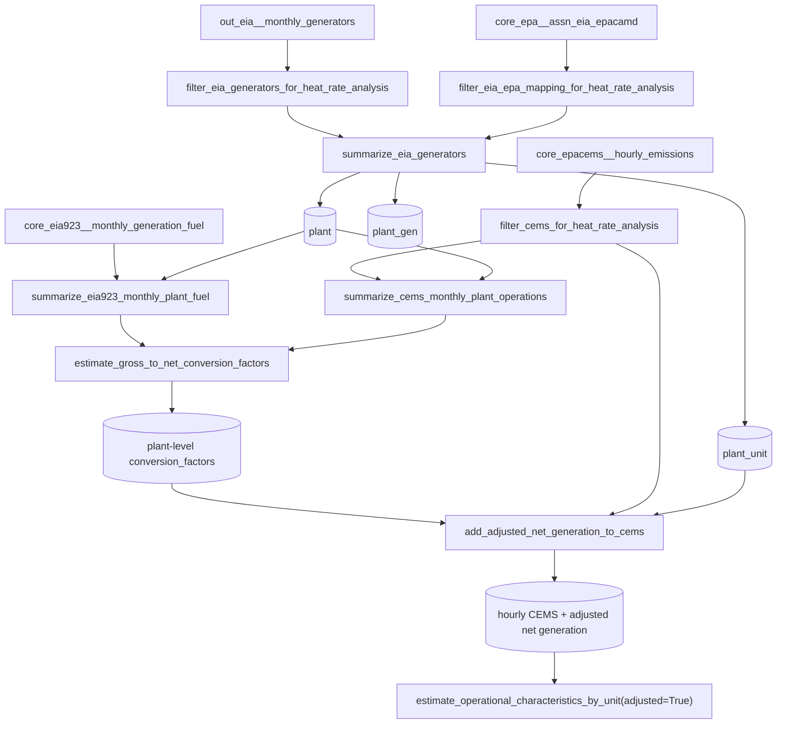

# Review: EIA-based operational-characteristics code

This reviews the "EIA-Based stuff" section of
`src/pudl/analysis/operational_characteristics.py` (everything after the
`out_epacems__yearly_operational_characteristics` asset) that was just uncommented
on the `adjusted-op-chars` branch. It's a working note for orienting on this code,
not documentation intended for `docs/`.

## What this code is for

The existing `out_epacems__yearly_operational_characteristics` asset estimates each
EPA CEMS unit's operational characteristics (min stable load, min up/down time, heat
rates, ramp rates) purely from **gross load** (`gross_load_mw`), because that's the
only generation signal EPA CEMS reports. Gross load overstates real output because it
doesn't net out a plant's own auxiliary/station power consumption.

The EIA-based code's job is to produce an *adjusted* version of the same estimates
using **net generation** instead, by statistically inferring an hourly net-generation
signal for CEMS units. EIA-923 reports monthly *net* generation per plant, but not
hourly and not per CEMS unit, so it can't be substituted in directly. Instead this
code:

1. Builds a monthly CEMS-vs-EIA923 ratio of net generation to gross load, per plant.
2. Applies that ratio back onto every hourly CEMS gross-load observation to get an
   estimated hourly net generation value.
3. Feeds the resulting "adjusted" hourly CEMS records through the *same*
   `estimate_operational_characteristics_by_unit()` pipeline already used for the
   unadjusted asset (via its existing `adjusted=True` branch in
   `handle_adjustment_in_cems()`), so the two variants share all of the load-factor
   binning, stable-run, heat-rate, and ramp-rate logic.

**Update**: this is now wired up as a dev-only asset,
`_out_epacems__yearly_operational_characteristics_adjusted` — see "Likely new
Dagster assets vs. helpers" below. `handle_adjustment_in_cems(adjusted=True)` had
been ready to accept pre-adjusted CEMS records since the earlier polars port, but no
function built those adjusted records and called it until now.

## Pipeline / data flow

## Function-by-function notes

- **`filter_eia_generators_for_heat_rate_analysis`** — Snapshots
  `out_eia__monthly_generators` to a single `report_date` (analogous to how
  `filter_cems_for_heat_rate_analysis` windows CEMS to a few years — EIA generator
  attributes are taken as of one month rather than averaged/windowed). *Helper*, not
  an asset.
- **`filter_eia_epa_mapping_for_heat_rate_analysis`** — Snapshots the
  `core_epa__assn_eia_epacamd` crosswalk to one `report_year`, since the EPA-to-EIA
  unit mapping can change year over year and CEMS units otherwise have no direct EIA
  identity. *Helper*.
- **`summarize_eia_generators`** — Turns the filtered generator snapshot into three
  capacity roll-ups keyed at generator, plant, and EPA-unit granularity
  (`max_cap_mw` = the larger of nameplate/summer/winter capacity; `max_mwh` = a
  theoretical max-output-for-a-30-day-month denominator used later for load
  factors). *Helper* — feeds capacity denominators to several downstream steps.
- **`summarize_eia923_monthly_plant_fuel`** — Monthly plant-level net generation,
  fuel consumed, and a **net-generation** load factor and heat rate, restricted to
  `data_maturity == "final"` records (i.e. no preliminary/early-release EIA-923
  data). This is the "ground truth" net-generation side of the ratio computed in
  `estimate_gross_to_net_conversion_factors`. *Helper*.
- **`summarize_cems_monthly_plant_operations`** — The same monthly rollup but from
  CEMS gross load / heat content, i.e. the "gross load" side of that same ratio.
  *Helper*.
- **`estimate_gross_to_net_conversion_factors`** — Joins the two monthly summaries
  and computes, per plant, the ratio of EIA-923 net generation to CEMS gross load
  (`gen_cems_to_net_gen_conversion_factor`) and of EIA-923 fuel-for-electricity to
  CEMS heat content (`fuel_cems_to_eia923_conversion_factor`), after dropping
  infinite/out-of-range ratios. **This is the core statistical estimate the whole
  "adjusted" pipeline rests on** — see the caveat below about it currently being a
  constant rather than a real fit. *Helper*, but arguably worth considering as its
  own small asset later (see below) since it's a reusable estimate independent of
  the final operational-characteristics computation.
- **`add_adjusted_net_generation_to_cems`** — Applies the plant-level conversion
  factors back onto every hourly CEMS record to produce
  `net_generation_mwh_cems`, `fuel_consumed_for_electricity_mmbtu_cems`,
  `heat_rate_net_generation_cems`, and `load_factor_adjusted_cems` — precisely the
  four columns `handle_adjustment_in_cems(adjusted=True)` expects to find already
  present on its input. *Helper* — this is the connective step between the two
  halves of the pipeline.

## How this relates to `out_epacems__yearly_operational_characteristics`

Both the existing (gross-load) asset and the not-yet-built adjusted asset go through
the *same* `estimate_operational_characteristics_by_unit()` and produce the same
output shape: one row per (`plant_id_epa`, `emissions_unit_id_epa`) with
`min_stable_load_factor`, `min_up_time_hours`, `min_down_time_hours`, the two heat
rate columns, and the two ramp-rate columns. The only difference is which four
input columns are fed to `handle_adjustment_in_cems` — gross-load columns already
present in raw CEMS vs. the net-generation columns synthesized by this EIA-based
pipeline. If/when this gets wired up, the natural output is a second table (or a
second column set on the existing table) carrying the net-generation-based
equivalents of the existing gross-load-based estimates, most usefully so they can be
compared against each other.

## Likely new Dagster assets vs. helpers

- **Done (dev-only)**: `_out_epacems__yearly_operational_characteristics_adjusted`
  wires the whole chain together — `filter_eia_generators_for_heat_rate_analysis` →
  `filter_eia_epa_mapping_for_heat_rate_analysis` → `summarize_eia_generators` →
  (per state) `summarize_eia923_monthly_plant_fuel` +
  `summarize_cems_monthly_plant_operations` →
  `estimate_gross_to_net_conversion_factors` → `add_adjusted_net_generation_to_cems`
  → `estimate_operational_characteristics_by_unit(adjusted=True)` — and produces the
  same per-unit shape as the existing asset, keyed by net generation instead of
  gross load. It uses the default (pickled) IO manager and a leading underscore
  (intermediate-asset naming convention), deliberately *not*
  `parquet_io_manager`/`pudl_io_manager`, since it isn't backed by a `Resource`
  metadata definition yet. Verified end-to-end against real Parquet data (ID, 2022)
  outside of Dagster, and `dg check defs` confirms the asset graph wiring itself
  (config schema, `AssetIn`s against real upstream asset keys) is sound. Not yet
  materialized nationally through `dg launch` — like the existing asset, it loops
  over all EPACEMS states unconditionally, which would be slow to use just for
  wiring verification.
- **Follow-up, deliberately deferred**: promoting this to a real, `Resource`-backed,
  Parquet-persisted output table (rename without the leading underscore, add
  `parquet_io_manager`, define a `Resource` + any new `Field`s for the adjusted
  columns) once the final column set is settled. Explicitly *not* doing this for the
  hourly-adjusted-CEMS intermediate (`add_adjusted_net_generation_to_cems`'s output)
  — that's a ~billion-row table and isn't worth persisting/pickling just for
  development.
- **Possible standalone asset**: `estimate_gross_to_net_conversion_factors`'s output
  (per-plant CEMS→EIA conversion factors) could be independently useful/interesting
  as its own small output table, separate from the final operational-characteristics
  numbers. Worth a product conversation, not a given.
- **Everything else reviewed here is a helper/intermediate transform**, not a
  standalone asset: `filter_eia_generators_for_heat_rate_analysis`,
  `filter_eia_epa_mapping_for_heat_rate_analysis`, `summarize_eia_generators`,
  `summarize_eia923_monthly_plant_fuel`, `summarize_cems_monthly_plant_operations`,
  `add_adjusted_net_generation_to_cems`.

## Bugs and fragile design choices (identified, not yet fixed)

1. **Fixed as part of this review** — `filter_eia_generators_for_heat_rate_analysis`
   compared `report_date` via `.str.to_datetime()`, which assumes a string column.
   `out_eia__monthly_generators.report_date` is a native `pl.Date` when read from
   Parquet (confirmed against `$PUDL_OUTPUT/parquet/out_eia__monthly_generators.parquet`),
   so `.str.to_datetime()` would raise at runtime once real data replaces a mocked
   pandas input. Now compares directly against a `datetime.date`.
2. **`estimate_gross_to_net_conversion_factors` computes a constant, not a fit.**
   The field names (`a0`, `a1`, `fit_type`, `..._at_min_load_factor`,
   `..._at_max_load_factor`) all imply a load-factor-dependent linear regression
   (`a0 + a1 * load_factor`), but every plant is currently assigned `fit_type =
   "constant"`, `a1 = 0.0`, and identical min/max-load-factor values — all just the
   plain mean of the observed monthly ratios. This is very possibly intentional
   scaffolding for a not-yet-implemented linear fit, but as written the "at min/max
   load factor" columns are misleading (they don't vary with load factor at all).
   Documented in the docstring; not changed.
3. **Downstream of (2), `add_adjusted_net_generation_to_cems` always multiplies by
   `..._at_max_load_factor`,** ignoring each hour's own load factor. This is a no-op
   today (every factor is identical), but would silently give the wrong answer if
   (2) is ever upgraded to a real load-factor-dependent fit, since low-load hours
   would get the max-load conversion factor. Documented in the docstring; not
   changed.
4. **Fixed as part of a later review pass** — the CEMS and EIA-923 monthly
   summaries in `estimate_gross_to_net_conversion_factors` were joined on
   `["plant_id_eia", "year", "month", "report_date", "capacity_mw",
   "summer_capacity_mw", "winter_capacity_mw", "max_cap_mw", "max_mwh"]`, i.e. on
   float capacity columns, not just IDs and dates. This only worked because both
   summaries were built by joining the *same* `eia_plant_summary` frame onto their
   respective monthly data, so the capacity columns were float-for-float identical
   — an innocuous refactor on either side (e.g. computing capacity slightly
   differently) would have silently turned this into an all-null join.

   Fixed by giving both monthly summaries a genuine, independently-derived monthly
   `report_date` — EIA-923 already has one natively; CEMS gets one synthesized via
   `operating_datetime_utc.dt.month_start()` in `summarize_cems_monthly_plant_operations`
   — and joining only on `["plant_id_eia", "report_date"]`. The duplicate capacity
   columns are no longer part of the key; they just ride along and get `_eia923`
   suffixed like any other overlapping non-key column. Along the way, the constant,
   single-snapshot `report_date` carried by `eia_plant_summary` (the generator
   capacity vintage, not a real per-month date) was renamed to
   `capacity_report_date` in `summarize_eia_generators` so it can't collide with the
   real monthly `report_date` used everywhere else. The standalone `year`/`month` int
   columns are no longer needed anywhere in this section as a result.
5. **Possible EIA/EPA crosswalk fan-out in `summarize_eia_generators`.** The
   `plant_gen` join against `eia_epa_mapping` is a left join on
   `["plant_id_eia", "generator_id"]`. If a generator maps to more than one EPA
   emissions unit in a given crosswalk year (a documented real-world case for
   multi-unit boiler/generator configurations — see
   `docs/methodology/entity_resolution.rst`, and note that
   `core_epa__assn_eia_epacamd` has no declared primary key in its resource metadata
   precisely because this relationship isn't 1:1), that generator's row is
   duplicated once per mapped unit before `plant_unit`'s
   `group_by(["plant_id_eia", "emissions_unit_id_epa"])` sums capacity. Whether
   that's correct depends on whether the crosswalk's capacity apportionment is
   already fractional per unit or represents the full generator capacity repeated —
   not something verifiable without inspecting real crosswalk data at scale. This
   join now has `validate="1:m"` (see below), which converts the risk from *silent*
   corruption to a loud `ComputeError` if the "generators are unique per
   `generator_id`" assumption is ever violated — but it doesn't resolve the
   capacity-apportionment question itself. Worth a second look before trusting
   `plant_unit.max_cap_mw` at scale.
6. **Fixed** — `estimate_gross_to_net_conversion_factors` had
   `pl.all().replace([inf, -inf], None)`, which applies float-infinity replacement
   to *every* column, including integer ID columns like `plant_id_eia`. This raised
   `InvalidOperationError: conversion from f64 to i64 failed` the first time this
   function was actually run against real data (during verification of item 4,
   above) — it had never been exercised end-to-end before. Scoped to just the two
   computed ratio columns (`gen_cems_to_net_gen_conversion_factor`,
   `fuel_cems_to_eia923_conversion_factor`).
7. **Untouched `# TODO: Validate merge?` in `summarize_cems_monthly_plant_operations`**
   — superseded by the `validate=` parameters added below; the TODO comment itself
   was removed since it's now addressed.

## Join cardinality validation

Every `.join()` in the module (not just the EIA-based section) now declares an
explicit `validate=` (`"1:1"`, `"1:m"`, or `"m:1"`) matching the cardinality the code
already assumed, so a violated assumption raises a `ComputeError` at `.collect()`
time instead of silently fanning out or dropping rows. `pl.DataFrame.update()` (used
a few times in `estimate_operational_characteristics_by_unit` to merge partial
results back onto the output shell) has no `validate` parameter in polars, so those
calls are unchanged.

All of the join-cardinality assumptions were spot-checked against real Parquet data
(EPA CEMS + EIA-923 + `out_eia__monthly_generators`, Idaho, 2022 snapshot) end to
end, including the fixed conversion-factor join and the inf-replace bug above — every
`validate=` held and the pipeline ran through `add_adjusted_net_generation_to_cems`
without error.

## Polars-idiom / signature cleanups made in this review

Per your note that we'll be reading PUDL tables straight out of Parquet as
`pl.LazyFrame`s, three signatures that still assumed a pandas input (and did their
own `pl.from_pandas(...).lazy()` conversion) were updated to take `pl.LazyFrame`
directly, with the conversion step removed:

- `filter_eia_epa_mapping_for_heat_rate_analysis(core_epa__assn_eia_epacamd: pd.DataFrame → pl.LazyFrame)`
- `summarize_eia923_monthly_plant_fuel(core_eia923__monthly_generation_fuel: pd.DataFrame → pl.LazyFrame)`
- `summarize_eia923_monthly_plant_fuel`'s `plant_ids_eia` parameter also moved from
  `pd.Series` to `pl.Series` (`.dropna()` → `.drop_nulls()`), for consistency with
  the rest of the polars-first pipeline. `filter_eia_generators_for_heat_rate_analysis`
  already took a `pl.LazyFrame`; only its internal `.str.to_datetime()` bug (item 1
  above) needed fixing.

`summarize_cems_monthly_plant_operations`, `estimate_gross_to_net_conversion_factors`,
and `add_adjusted_net_generation_to_cems` were already pure `pl.LazyFrame` in and
out, with no pandas fallback — no signature changes needed there.

Docstrings in this section were already fairly complete (Args/Returns present on
every function); the main additions were the "why this matters / known limitation"
paragraphs called out in items 2 and 3 above, since those aren't derivable just from
reading the code.
